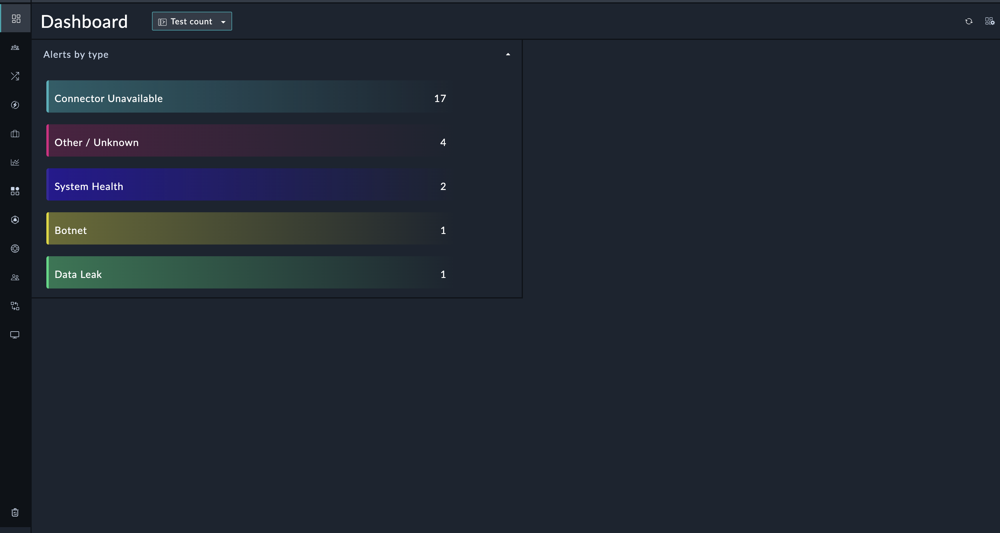

| [Home](../README.md) |
|----------------------|

# Usage

The Top-X Records Widget is designed to provide users with a concise and informative summary of the most relevant data from a selected module. This widget, aptly named "top-x," enables users to quickly identify the top 3 or top 5 records based on a specific field selected within the chosen module.

## Widget Preview and How to Use
This section details the process to edit the widget and use it with data from a specific record or from across multiple modules.

### Count of Records Across Modules
Edit a module's (e.g. *Dashboard*) view template and select **Add Widget** button.

Select **Top X** from the list to bring up the **Top X** widget's customization modal.

  

Max Record Limit: Users have the flexibility to select the number of top records they want to display, either the top 3 or the top 5, depending on their requirements.

Module Selection: The widget allows users to choose a target module from which they want to fetch data. For example, selecting the "Alerts" module will fetch alerts count.


Field Selection: Users can specify a particular field within the selected module to analyze. For instance, they can choose the "type" field to determine the top types of alerts.

Sorting Order: The top records are listed in descending order, making it effortless to identify the most critical or significant data points at a glance.

  


### Record containing JSON Data

  

Specify the title of the funnel chart in the **Title** field.

Select **Record containing JSON Data** in the *Data Source* field.

Select a module whose records contain `JSON` data. 

Define filters under the field **Filter Record Which Contains The JSON Data**. The filter conditions should be such that they select only the record that contains the relevant data.


Select the field (the field must be of type `JSON`).

    *Below is an example of the field's value*:
    
```JSON 
  "topXbyIncidents": {
    "HR": 11,
    "Self": 3,
    "Finance": 6,
    "Dubai SoC": 4
  }
```

  In the field, "Enter the key of object to be rendered" contains the main key of the object "topXbyIncidents", if there is no key for the object leave the field blank.

#### Advanded Settings:
For this feature to work, user need to add a Widget with Broadcasting capability in the same dashboard. eg. (Record Summary Card Widget).

Update content on receiving event:
This toggle button emables the Top X widget to Listen to an on-click event, broadcasted by another widget eg. Record Summary Card.
Give the exact same event name in this widget, as given to the Record Summary Card widget


JSON, edit view and widget, when looked at simultaniously gives a clearer picture

| [Installation](./setup.md#installation) | [Configuration](./setup.md#configuration) |
|-----------------------------------------|-------------------------------------------|