| [Home](../README.md) |
|----------------------|

# Usage

The Top-X Records Widget is designed to provide users with a concise and informative summary of the most relevant data from a selected module. This widget, aptly named *Top X*, enables users to quickly identify the top 3 or top 5 records based on a specific field selected within the chosen module.

## Top X Widget Edit View

This section details the process to edit the widget and use it with data from a specific record or from across multiple modules.

1. Edit a *Dashboard*'s view template and select **Add Widget** button.

2. Select **Top X** from the list to bring up the **Top X** widget's customization modal.

3. Specify the title of the *Top X* chart in the **Title** field.

4. Specify the maximum record limit for this widget to display. The available options are:
    - 3
    - 5

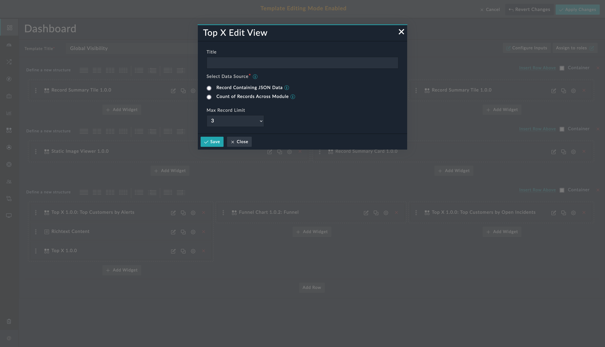

### Record containing JSON Data

This option helps retrieve and display data from a record that has values in `JSON` format. Select the **Record containing JSON Data** option if all data to be rendered is in a specific field of the module. The widget has filters to select only that record that meets the filter conditions.

1. Select **Record containing JSON Data** in the *Select Data Source* field.

    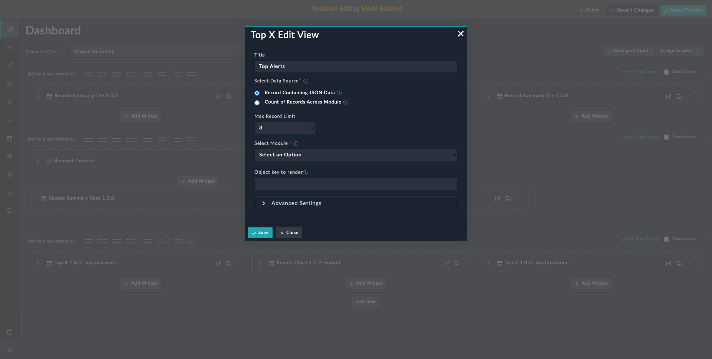

2. Select a module whose records contain `JSON` data, in the **Select Module** field. In the following screenshot, we have selected a custom module that we created. For details on editing and creating modules, refer to the *Module Editor* section of the FortiSOAR *Administration Guide*, [here](https://docs.fortinet.com/document/fortisoar/7.4.1/administration-guide/97786/application-editor#Module_Editor).

    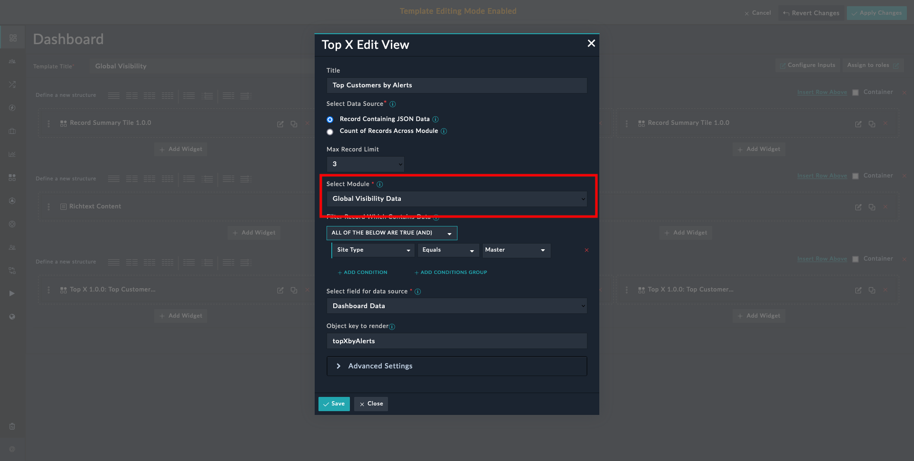

3. Define filters under the field **Filter Record Which Contains The JSON Data**. In the following screenshot we filter the record by **_Site Type_**. You can define any other filter condition.

    <table>
        <tr>
            <th>NOTE</th>
            <td>The filter conditions should be such that they select <strong><em>only</em></strong> the record that contains relevant JSON data.</td>
        </tr>
    </table>

    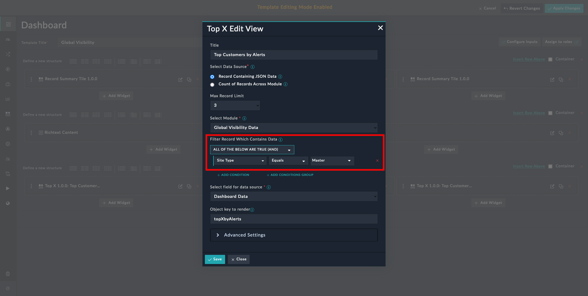

4. Select the field, whose data is to be displayed, in the **Select field for data source** field. The drop-down lists **_only_** the fields of type `JSON`. In the following screenshot, we have selected a field within the custom module that we created. For details on editing and creating fields, refer to the *Module Editor* section of the FortiSOAR *Administration Guide*, [here](https://docs.fortinet.com/document/fortisoar/7.4.1/administration-guide/97786/application-editor#Module_Editor).

    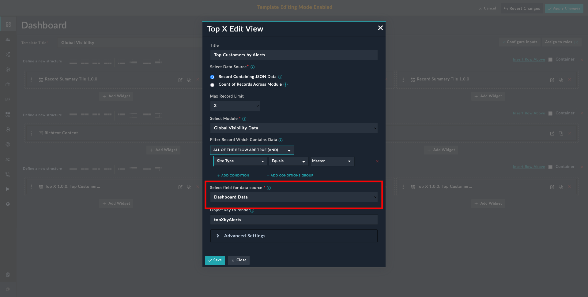

5. Specify the JSON `key` whose `value` is to be rendered in the **Object key to render** field. In the following screenshot, we have selected a key in the JSON data content of the custom module that we created. The example block contains the sample data that we used.

    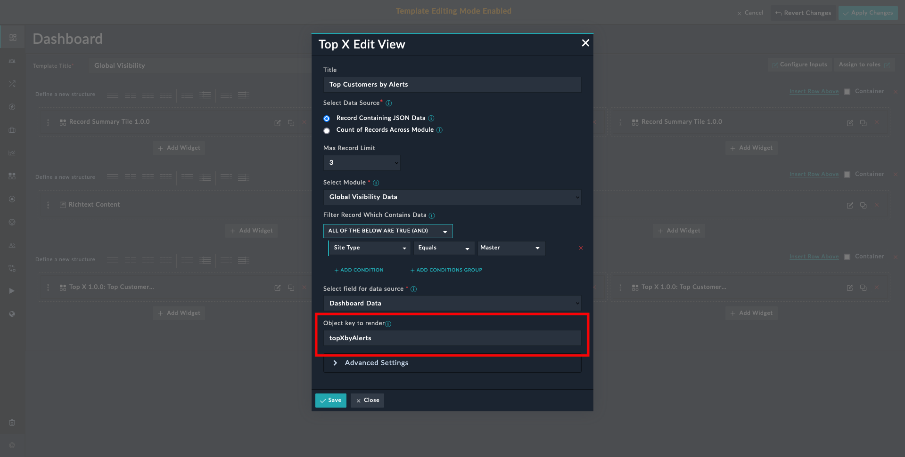

    <table>
        <thead>
            <th>Example</th>
        </thead>
        <tbody>
            <td>Consider the following JSON data in one of the record's JSON field:
                <pre>"topXbyAlerts": {
                    "Connector Unavailable": 17,
                    "Other/Unknown": 4,
                    "System Health": 2,
                    "Botnet": 1,
                    "Data Leak": 1
                }</pre>
                
The following screenshot shows the Top X Widget in action with this JSON data.

                
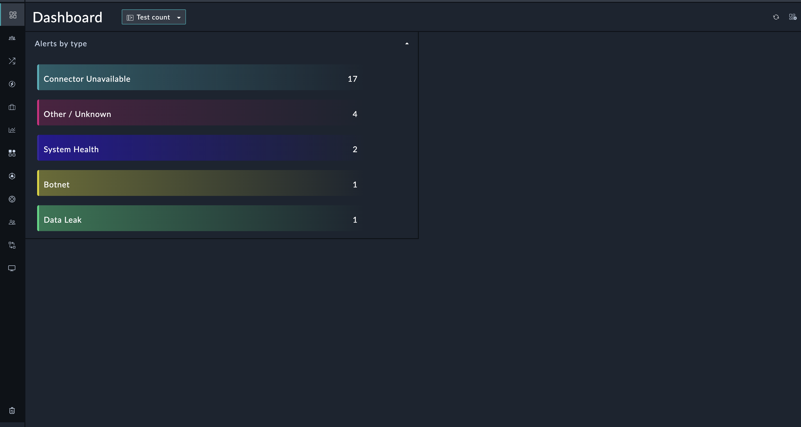

            </td>
        </tbody>
    </table>

#### Advanced Settings

Under **Record containing JSON Data** > **Advanced Settings**, this widget can be configured to listen to events *broadcasted by another widget in the same dashboard*. An example of a broadcasting widget is the **Record Summary Card** widget.

In the following screenshot, we have selected the event name being broadcasted by the *Record Summary Card* widget.

Make a note of the event name being broadcasted by the widget. Use the exact event name when configuring *Top X*'s event listener.

<table>
    <tr>
        <th>IMPORTANT</th>
        <td>The event listening is triggered when you click a <em>Record Summary Card</em>. The <em>Top X</em> widget looks for compatible JSON data in the same record that contains data for the <em>Record Summary Card</em> widget. The <em>Top X</em> widget must be appropriately configured to use data from that record for the event listening to work as intended.</td>
    </tr>
</table>

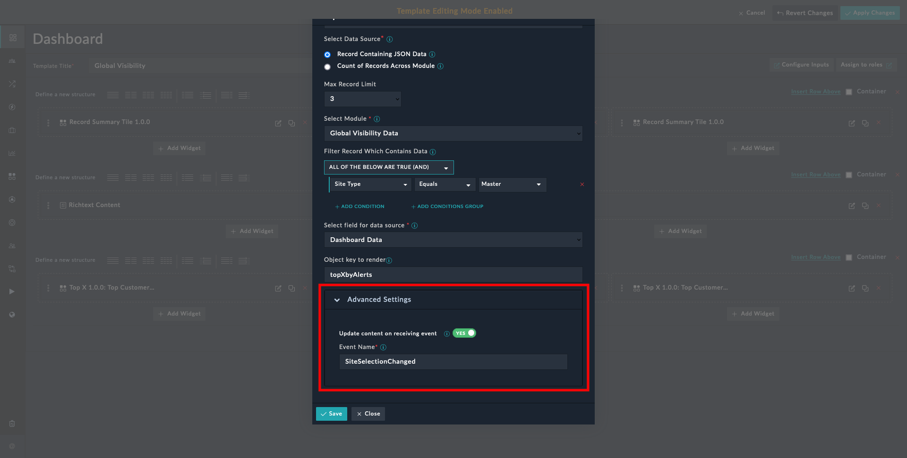

___
The *Record Summary Card* widget can render and broadcast multiple JSON keys as cards. With the selection of a card the broadcasted event changes. Event listener widgets, such as *Top X*, can listen to these events and render the JSON data broadcasted by the selected card. This is helpful when managing multiple sites with varied data. Clicking a site card can generate targeted data for that site.

Following image is a side-by-side comparison of how selecting a different card, updates the associated data:

|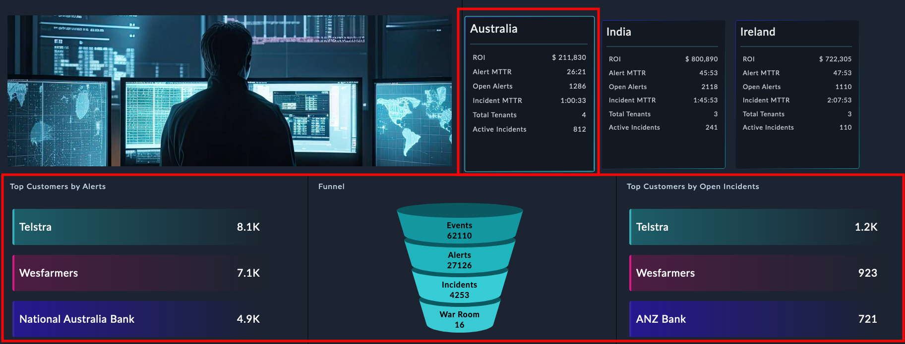|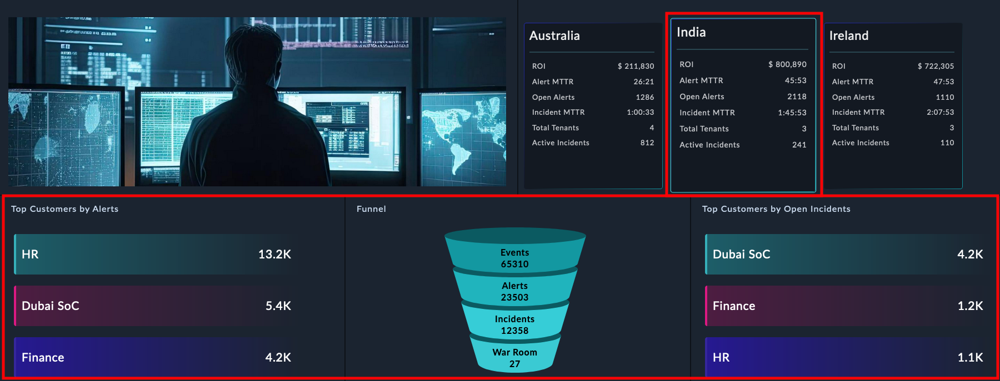|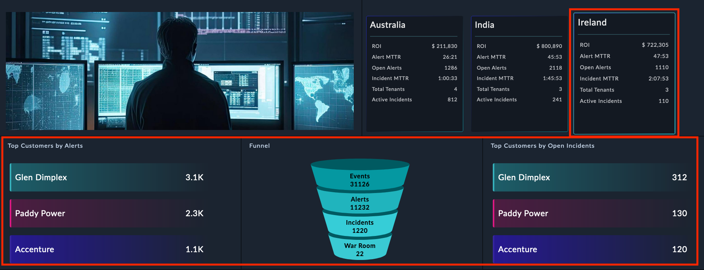|
|:-|:-|:-|
|Selected card *Australia*|Selected card *India*|Selected card *Ireland*|
___

### Count of Records Across Modules

This option helps retrieve and display data from records across multiple modules. Select the **Count of Records Across Module** option to show data across modules. The widget has filters to select only that record that meets the filter conditions.

1. Select **Count of Records Across Module** in the *Select Data Source* field.

2. Select a module (e.g. *Alert*) in the **Select Module** field.

3. Define filters under the field **Filter Record**.

4. Select the field whose values are to be displayed by this widget in the **Select Picklist or Lookup Field**. Only fields of type *Lookup* or *Picklist* are displayed.

Following is an example configuration of the widget:

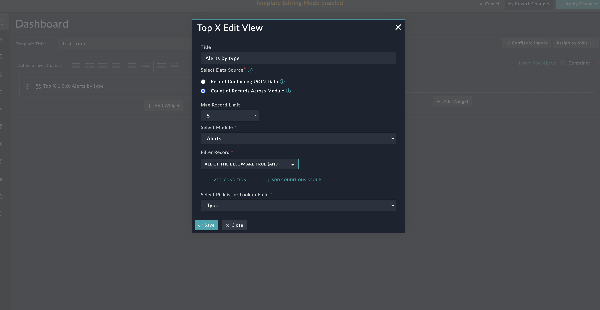

This configuration gives the following output, depending on the alerts and their type, on your FortiSOAR&trade; instance:

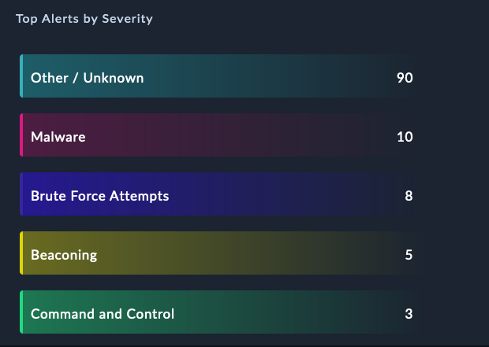

| [Installation](./setup.md#installation) | [Configuration](./setup.md#configuration) |
|-----------------------------------------|-------------------------------------------|